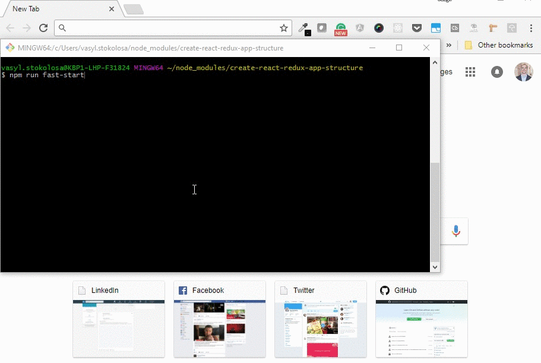

# Create React Redux App Structure [](https://twitter.com/intent/tweet?hashtags=reactjs%20%23redux%20%23javascript&original_referer=https%3A%2F%2Fpublish.twitter.com%2F&ref_src=twsrc%5Etfw&text=Start%20your%20project%20fast%20with%20Create%20React%20Redux%20App%20Structure&tw_p=tweetbutton&url=https%3A%2F%2Fgithub.com%2Fshystruk%2Fcreate-react-redux-app-structure&via=shystrukk) #

[](https://opensource.org/licenses/mit-license.php) [](https://codecov.io/gh/shystruk/create-react-redux-app-structure) [](https://travis-ci.org/shystruk/create-react-redux-app-structure) [](https://badge.fury.io/js/create-react-redux-app-structure)

Create React + Redux app structure with build configurations.

## What can I find here? ##
- Express, Cors
- React + Redux, ES6, async/await
- React Router
- Internationalization
- SASS
- PostCSS (autoprefixer), so you do not need -webkit, -moz or other prefixes
- Build script configuration **Development, Staging, Production** with CDN, [cache-busting](https://www.keycdn.com/support/what-is-cache-busting/) support
- Build script to bundle JS, CSS, with sourcemaps
- Unit tests Jest, Enzyme
- E2E Cypress tests
- ESLint
- Ghooks (pre-commit with unit tests and eslint validation)
- Code Coverage (https://codecov.io)
- Travis CI runs Unit and E2E tests and report to codecov

## Quick Start ##
Create React + Redux app structure works on macOS, Windows, and Linux.
If something doesn’t work, please file an [issue](https://github.com/shystruk/create-react-redux-app-structure/issues/new).

#### npm
`npm i -g create-react-redux-app-structure`

#### yarn
`yarn add -g create-react-redux-app-structure`

```
create-react-redux-app-structure my-app
cd my-app/
npm run fast-start
```
http://localhost:8080/ will be opened automatically.

When you are ready to deploy to staging/production please see [Build Scripts](#build-scripts) section.

## Getting Started ##
Install it once globally:

#### npm
`npm i -g create-react-redux-app-structure`

#### yarn
`yarn add -g create-react-redux-app-structure`

> Patience, please. It takes time, most of it is spent installing npm packages.

### Creating an App ###
To create a new app, run:
```
create-react-redux-app-structure my-app
cd my-app/
```
It will create a directory called my-app inside the current folder.

### Prepare config.json for build configurations ###
For running builds you need to have **config.json** in app/ folder.
So you can create new one or rename **app/config.json.example**.  

Inside that file:
 - **PATHS** is used in Grunt and Gulp tasks
 - **assetHost** CDN path for each build
 - **serverHost** is used for running e2e Cypress tests

### Installation ###
**`npm install`** or **`yarn install`**

>You can run **npm run fast-start** script, it will install all npm packages, run dev build, server and open http://localhost:8080/



### Run build script ###
Have a look at [Build Scripts](#build-scripts) section

### Run server ###
**`node index.js`** or **npm run server**

Then open http://localhost:8080/ to see test weather app :)

## Build scripts ##
Development - **`npm run dev`** or **`yarn run dev`**

Production - **`npm run prod`** or **`yarn run prod`**

Staging - **`npm run staging`** or **`yarn run staging`**


## Tests ##
Unit - **`npm run test`** or **`yarn run test`**

Unit with watch - **`npm run test:watch`** or **`yarn run test:watch`**

E2E - **`npm run e2e`** or **`yarn run e2e`**

Coverage is here - *app/tests/__tests__/coverage/Icon-report/index.html*


## Automation tests ##
Let's imagine that for automation tests we need to get access to the Redux store.
We can do that by adding to the `window` object property with reference to the store. For e.g. in `app.jsx` file.
Automation tests run only in **staging**, so for production build we remove them out by Grunt task `strip_code` 

```javascript
/* staging-code */
window.store = store;
/* end-staging-code */
```

## Tips ##
Kill all node processes:
- MacOS `sudo killall -9 node`
- Windows (cmd) `taskkill /f /im node.exe`

## Detailed description about features and approaches ##
- [How create-react-redux-app-structure helps you to start a project faster](https://medium.com/@shystruk/how-create-react-redux-app-structure-helps-you-to-start-a-project-faster-cf564c64689c)
- [clearIntervals() when user has a nap](https://codeburst.io/clearintervals-when-user-has-a-nap-3bf8010c986b)
- [Do you still register window event listeners in each component?](https://medium.com/@shystruk/do-you-still-register-window-event-listeners-in-each-component-react-in-example-31a4b1f6f1c8)

## Contributing ##

I would love to have your help. 

If you have an idea how to improve or found an issue please read the [Contributions Guidelines](CONTRIBUTING.md) before submitting a PR.
Thanks!

## License

MIT © [Vasyl Stokolosa](https://about.me/shystruk)
